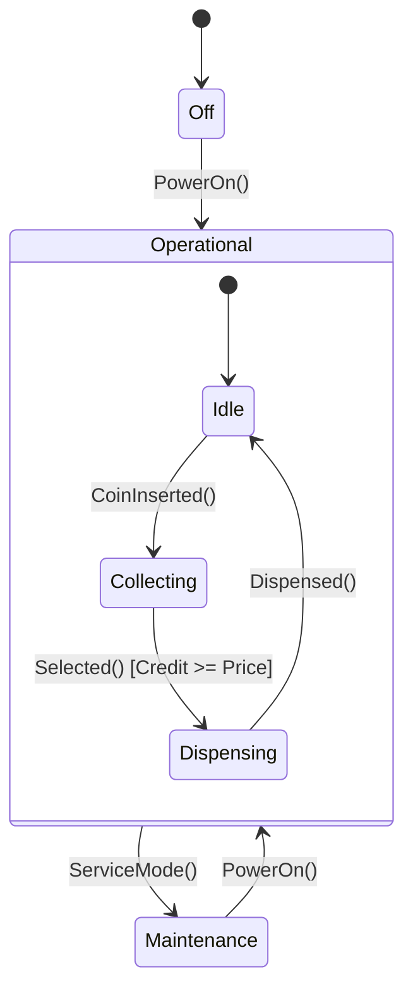
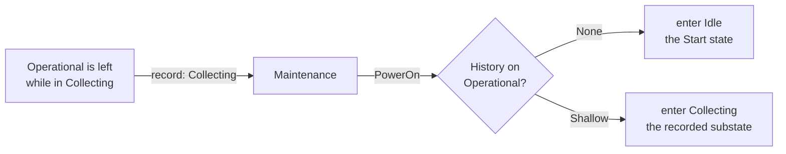
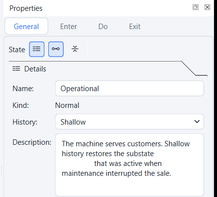
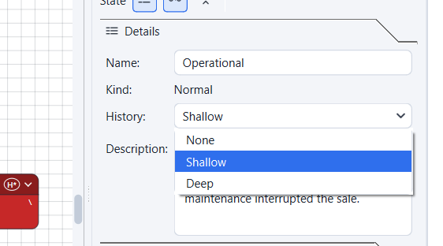
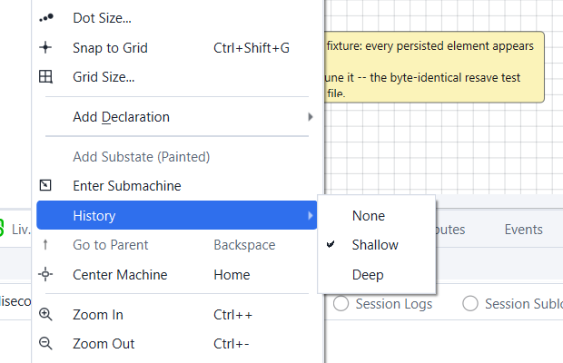
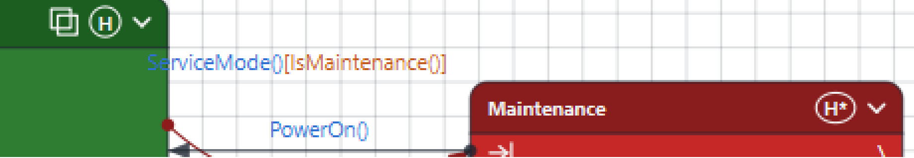
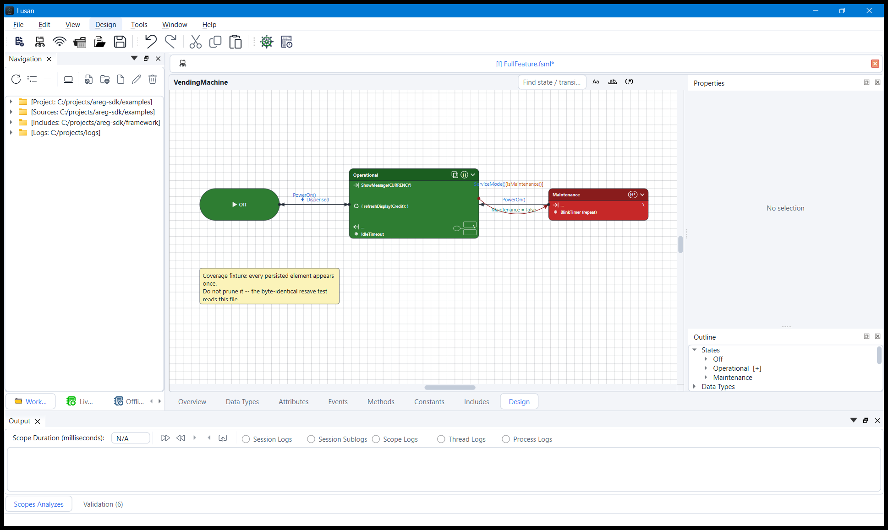
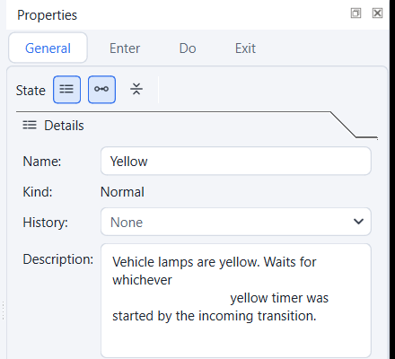
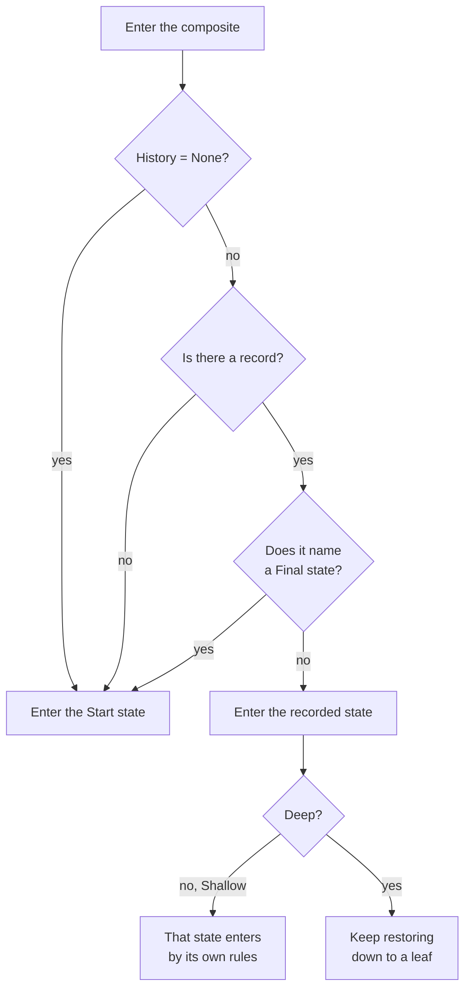

# History: making a state resume where it left off

**Who this is for:** anyone using the Lusan State Machine Designer, including a first-time
user. You do not need to know UML. Everything is explained from the beginning, and every step
is shown on a real screen.

**What you will learn:** what history does, when to reach for it, the exact click path to turn
it on, what the file looks like afterwards, and the handful of rules that decide what happens
at run time.

**Related:** [`fsm-designer.md`](./fsm-designer.md) for the editor as a whole.

---

## Table of contents

1. [The one-sentence version](#1-the-one-sentence-version)
2. [Words you need first](#2-words-you-need-first)
3. [The problem, with a real machine](#3-the-problem-with-a-real-machine)
4. [Shallow: resume the substate](#4-shallow-resume-the-substate)
5. [Deep: resume the whole path](#5-deep-resume-the-whole-path)
6. [Step by step in the editor](#6-step-by-step-in-the-editor)
7. [Reading the diagram: the badges](#7-reading-the-diagram-the-badges)
8. ["The combo is greyed out"](#8-the-combo-is-greyed-out)
9. [The rules, precisely](#9-the-rules-precisely)
10. [The file format and schema](#10-the-file-format-and-schema)
11. [Validation: the two rules that mention history](#11-validation-the-two-rules-that-mention-history)
12. [Frequently asked questions](#12-frequently-asked-questions)
13. [Checklist](#13-checklist)

---

## 1. The one-sentence version

A state that contains other states can be told to **remember which one was active when you left
it**, so that coming back continues instead of starting over. That setting is one attribute,
`History`, and it has three values: `None` (the default), `Shallow` and `Deep`.

---

## 2. Words you need first

Four terms, and then nothing in this document is unfamiliar.

| Term | Meaning |
|---|---|
| **State** | A situation the machine can be in. `Idle`, `Dispensing`, `Maintenance`. |
| **Transition** | A labelled arrow from one state to another. It fires when its stimulus arrives and its guard passes. |
| **Composite state** | A state that contains a whole machine of its own inside it. Also called a state with a **submachine**. On the canvas you descend into it by double-clicking it. |
| **`Start` state** | Every level has exactly one. Entering a level means entering its `Start` state and following the arrows from there. |

The important one is **composite**. History exists only on composite states, because history
remembers *which inner state* was active, and a state with nothing inside it has nothing to
remember. If you take one thing from this document, take that.

A state becomes composite in one of two ways:

1. **Painted**: you draw the inner states yourself, inside it.
2. **Imported**: it is backed by another `.fsml` file (`Submachine="Alias"`). Note that the
   editor has no UI for setting an import yet, so today this comes from hand-editing the file.

Both count as composite, and history works the same on both.

---

## 3. The problem, with a real machine

Here is a vending machine. The top level has three states:



If the diagram above does not render in your viewer, read it as this:

| Level | States | Arrows |
|---|---|---|
| Top | `Off` (Start), `Operational` (composite), `Maintenance` | `Off -> Operational` on `PowerOn()`; `Operational -> Maintenance` on `ServiceMode()`; `Maintenance -> Operational` on `PowerOn()` |
| Inside `Operational` | `Idle` (Start), `Collecting`, `Dispensing` | `Idle -> Collecting` on `CoinInserted()`; `Collecting -> Dispensing` on `Selected()` when the credit covers the price; `Dispensing -> Idle` on `Dispensed()` |

### The scenario

A customer has fed **1.50** into the machine and is looking at the buttons. The machine is in
`Operational > Collecting`.

A technician turns the service key. `ServiceMode()` fires, and the machine leaves `Operational`
for `Maintenance`. The technician finishes and turns the key back, so `PowerOn()` fires and the
machine goes back to `Operational`.

**What does the customer see now?**

### With `History="None"` (the default)

Entering a composite means entering its `Start` state. So the machine lands in `Idle`. The
display goes back to the price list.

The credit attribute still holds 1.50, but the machine no longer *behaves* as though a sale is
in progress: it is in `Idle`, and `Idle` has exactly one way out, `CoinInserted()`. The
customer presses a button and nothing happens. They have to insert another coin first.

That is a bug in the design. And notice it is not a bug you can fix by storing more data: the
credit was never lost. What was lost is **where the machine was**.

### The workaround people write instead

Without history you would add an attribute such as `Phase`, set it on every transition inside
`Operational`, and give `Idle` a set of guarded transitions that jump to the right place when
`Phase` says so. That is one attribute, several assignments and several transitions to express
a single idea, and every one of them is somewhere to make a mistake.

History says the same thing with one setting.

---

## 4. Shallow: resume the substate

Set `History` on `Operational` to **`Shallow`**.

Now, when the machine left `Operational`, it privately recorded which direct substate was
active: `Collecting`. On the way back it reads that record and enters `Collecting` instead of
`Idle`.

The customer finds their sale exactly where they left it. The next button press works. Nothing
else in the design changed.



---

## 5. Deep: resume the whole path

`Shallow` remembers **one level down**. That is enough until an inner state is itself composite.

Suppose `Collecting` is really two phases, so it becomes composite too:

| Inside `Collecting` | Role |
|---|---|
| `AwaitingCoins` (Start) | Credit is below the cheapest product |
| `CanBuy` | Credit covers something; the buttons are lit |

Our customer at 1.50 is three levels deep: `Operational > Collecting > CanBuy`.

| Setting on `Operational` | Where the machine lands | What the customer sees |
|---|---|---|
| `None` | `Idle` | Sale gone |
| `Shallow` | `Collecting`, which then enters **by its own rules**. It has no history of its own, so it goes to its `Start` state, `AwaitingCoins` | Sale back, but the buttons are dark despite 1.50 of credit |
| `Deep` | `Collecting`, then `CanBuy` | Everything exactly as it was |

**`Deep` means "keep restoring all the way down".** `Shallow` means "restore one level and let
that level decide for itself".

Two ways to get the same result, which is worth knowing:

1. `Deep` on `Operational`, or
2. `Shallow` on `Operational` **and** `Shallow` on `Collecting`.

Use `Deep` when the whole subtree is one activity. Use per-level `Shallow` when some inner
level genuinely should restart. If you are not sure, `Deep` is the safer default for an
"interrupt and resume" design.

---

## 6. Step by step in the editor

### Step 1: make the state composite (skip if it already is)

History is only appliable to a composite state, so this comes first.

Select a `Normal` state, then either:

- right-click it and choose **Add Substate (Painted)**, or
- use **Design -> Add Substate (Painted)**, or
- double-click the state's **body** (not its header).

Lusan converts the state, creates the mandatory `Start` state of the new inner level, and
**descends into that level** so you can start drawing. That last part matters for the next step.

> `Start` and `Final` states can never contain substates, so they can never take history.
> **Add Substate** is greyed out on them, and so is **History**.

### Step 2: come back up and select the state

Because step 1 took you *into* the new level, the composite state itself is no longer selected.
Press **`Backspace`** (or click the parent in the breadcrumb bar) to go back up, then click the
state once.

### Step 3: set the mode

The **Properties** panel, **General** tab, now offers **History**:



Open it and pick a mode:



The same three modes are on the state's **right-click menu** and on the **Design** menu, under
**History**. A check mark shows the current mode:



All three surfaces do the same thing and each change is **one undo step**, so `Ctrl+Z` puts the
previous mode back. Switching from `Shallow` to `Deep` is a second step, not an edit of the
first.

> **Known issue:** the **Design** menu can show **History** greyed on the *first* opening
> straight after the selection was made from the canvas search box; opening the menu again
> shows it correctly. The right-click menu and the Properties panel are not affected. Use
> either of those if you hit it.

---

## 7. Reading the diagram: the badges

A state with history wears a badge in its **header**:

| Badge | Mode |
|---|---|
| `H` | `Shallow` |
| `H*` | `Deep` |



On the left, `Operational` carries the composite badge (two overlapping squares) and the `H`
history badge. On the right, `Maintenance` carries `H*`.

Because the badge lives in the header and collapsing a state only removes its **body**,
**collapsing never hides the badge**. You can always tell at a glance which states resume.

Here is the same thing in a whole diagram:



---

## 8. "The combo is greyed out"

This is the most common first question, and it is not a bug.



The state `Yellow` above is a plain `Normal` state with nothing inside it. It has no substates,
so there is nothing for history to remember, and the field is disabled with `None`.

**To enable it, give the state a submachine** ([step 1 above](#step-1-make-the-state-composite-skip-if-it-already-is)).
The field comes alive as soon as the state has one.

Quick diagnosis:

| What you see | What it means | What to do |
|---|---|---|
| Field greyed, `Kind: Normal` | The state has no submachine | **Add Substate (Painted)**, then `Backspace` back up and re-select |
| Field greyed, `Kind: Start` or `Final` | These kinds can never hold substates | Put the history on the composite that *contains* this state, if that is what you meant |
| Menu reads `History (needs a submachine)` | Same thing, said in the menu | As above |
| Field live but you cannot find the state | You are inside the submachine, not on the state | `Backspace` goes up one level |

---

## 9. The rules, precisely

Everything so far in one place. This section is the reference; the earlier sections are the
explanation.

### 9.1 What is remembered

Each composite that declares history owns **one record**: which substate was active when it was
last left.

- It is written **every time the composite is exited**, including when a transition on an
  ancestor exits the whole subtree at once. A top-level `PowerOff` still leaves every composite
  on the way out with its record written.
- It is **run-time state only**. It is never saved in the `.fsml` file and never appears in the
  document. Your file stores the *intention* (`History="Shallow"`), never the position.
- It starts **empty** when the machine starts, and a machine reset clears it again.

### 9.2 What happens on entry

Every time the machine enters a composite state, in this order:

1. `History="None"`, **or** no record yet, **or** the recorded state has since been deleted
   from the design: enter the `Start` state and follow its chain.
2. The record names a `Final` state: enter the `Start` chain. The inner machine finished last
   time, and there is nothing meaningful to resume.
3. Otherwise: enter the recorded state.

Having entered the recorded state:

- **`Shallow` stops there.** That substate then enters by its own rules: its own history if it
  declares one, its own `Start` chain if it does not.
- **`Deep` keeps going down.** If some level on the way down has no usable record, that level
  falls back to its own `Start` chain and the levels above it still stand. The fallback is
  local, never global.



### 9.3 Operations still run

**Entry operations run for every state actually entered on the restored path**, outermost
first, exactly as in an ordinary `Start` descent. History changes *which* states are entered,
never *whether* their entry operations run.

This is what makes history safe to adopt. In the vending machine, if `Collecting` has an entry
operation that refreshes the display with the current credit, that operation runs on the way
back in and the display is correct. You do not have to duplicate anything onto the
`Maintenance` transition.

Exit is unchanged and symmetric: exit operations run from the active innermost state outwards
to the state the transition belongs to, and the records are written during that walk.

### 9.4 Imported submachines

A composite backed by an imported `.fsml` follows the same rules. The host's `History` governs
the imported machine's top level, and composites inside the imported document keep their own
records, so a `Deep` restore reaches into it normally.

Two states that host the **same** import keep **separate** records, because a record belongs to
the hosting state, not to the imported file. Two coffee makers built from one `Brewing.fsml`
resume independently.

### 9.5 Self-transitions

A transition from a composite back to itself is a real exit followed by a real entry: exit
operations run, the record is written, entry operations run, the record is read back. With
`Shallow` or `Deep` the machine returns to where it was rather than to `Start`.

That is a supported way of saying "run the exit and entry behaviour again without losing the
position", not an edge case.

---

## 10. The file format and schema

`History` is a single optional attribute on `<State>`, written only when it is not `None`:

```xml
<State ID="43" Name="Operational" Kind="Normal" History="Shallow" OnFinal="Dispensed">
    <Description>The customer-facing part of the machine.</Description>
    <TransitionList>
        <Transition ID="48" StimulusKind="Trigger" Stimulus="ServiceMode" To="76"/>
    </TransitionList>
    <StateList>
        <State ID="50" Name="Idle"       Kind="Start"/>
        <State ID="60" Name="Collecting" Kind="Normal"/>
        <State ID="70" Name="Dispensing" Kind="Normal"/>
    </StateList>
</State>
```

The schema (`.claude/fsml.xsd`) declares it as a closed enumeration:

```xml
<xs:simpleType name="tHistory">
    <xs:restriction base="xs:string">
        <xs:enumeration value="None"/>
        <xs:enumeration value="Shallow"/>
        <xs:enumeration value="Deep"/>
    </xs:restriction>
</xs:simpleType>
```

and attaches it to a state alongside the other two composite-only attributes:

```xml
<xs:attribute name="ID"         type="tId"         use="required"/>
<xs:attribute name="Name"       type="tIdentifier" use="required"/>
<xs:attribute name="Kind"       type="tStateKind"  use="required"/>
<xs:attribute name="History"    type="tHistory"/>
<xs:attribute name="Submachine" type="tIdentifier"/>
<xs:attribute name="OnFinal"    type="tIdentifier"/>
```

Three things follow from this, worth knowing if you ever hand-edit a file:

1. **`History="None"` is never written.** The default is expressed by the attribute's absence,
   so files stay small and diffs stay quiet.
2. **The value is case-sensitive and closed.** `shallow` or `Sideways` is not valid; the reader
   treats an unrecognized value as `None` and the schema rejects it outright.
3. **A half-built submachine takes the attribute with it.** If you create a submachine but
   leave it holding only its `Start` marker, Lusan does not save that submachine (it is not a
   real machine yet) and the state is written as a plain leaf. `History` and `OnFinal` are
   dropped along with it, so the file you reopen never carries attributes its state can no
   longer justify. Finish the submachine and both come back.

---

## 11. Validation: the two rules that mention history

Findings appear in the **Validation** tab of the output window. `F8` and `Shift+F8` step
through them, and activating one jumps to the element.

### Error 10.1.18: history on a state that is not composite

> *History is only allowed on a composite state*

The editor prevents you from creating this, so you will only see it on a file that was
hand-edited or generated. Fix it by either giving the state a submachine or removing the
attribute.

### Warning 10.2.10: history that can never be used

> *History on 'X' is never re-entered*

The composite declares history but nothing ever brings the machine back to it, so the record
would be written and never read.

"Re-entered" is precise here, and the precision matters:

- a transition from an **ordinary sibling state** counts;
- a **self-transition** counts;
- a transition out of the level's **`Start` state does not count**. A `Start` state can never be
  the target of a transition, so it is left exactly once, and the transition leaving it is the
  first entry rather than a return.

If this warning fires on a composite where resuming genuinely matters, the finding is usually
not about the history attribute at all. It is telling you that the transition which brings the
machine back has not been drawn yet.

---

## 12. Frequently asked questions

**Is the remembered position saved in my file?**
No. The file stores the setting; the position lives only in the running machine and is cleared
on start and on reset.

**Does the machine remember across a restart?**
No. Every run begins with every record empty, so the first entry always follows the `Start`
chain.

**What happens if I delete the state that was remembered?**
Nothing breaks. A record pointing at a state that no longer exists is treated as no record, and
the composite falls back to its `Start` chain.

**What if the inner machine had finished?**
If the record names a `Final` state, the composite falls back to its `Start` chain. You resume
an interrupted activity, never a completed one.

**Can a `Start` or `Final` state have history?**
No. Neither can contain substates, so both permanently show the field disabled.

**Can I set history on an imported submachine?**
Yes in the format, and it works exactly as for a painted one. But the editor has no UI for
attaching an import yet, so today the `Submachine` attribute has to be hand-written.

**Does `Deep` cost more at run time?**
One record per composite on the active path either way. `Deep` reads more of them on entry;
that is the whole difference.

**Does turning history on change my existing behaviour?**
Only the first entry stays identical. Every later entry may land somewhere other than `Start`,
which is the point. Re-read any entry operations on the composite that assume they are followed
by the `Start` state.

**Is history running today?**
The setting, the editing, the badge, the file round-trip and both validation rules ship now.
Executing a machine is a separate track: the interactive test mode and the code generator apply
these rules when they land. Until then history is part of the design you author and hand over,
not something Lusan runs for you.

---

## 13. Checklist

Before you call a history design finished:

1. The state carrying `History` is **composite** (the field was enabled, and the canvas shows a
   composite badge).
2. At least one transition from an **ordinary sibling** comes back to it, so the record is
   actually read. No 10.2.10 warning.
3. You chose `Shallow` or `Deep` deliberately: `Deep` if the whole subtree is one activity,
   `Shallow` if the inner levels should restart.
4. The composite's **entry operations** still make sense when the machine lands on a restored
   substate rather than on `Start`.
5. If an inner level should restart while its parent resumes, that level has `History="None"`
   and the parent has `Shallow` (not `Deep`).
6. The Validation tab is clean of history findings.
